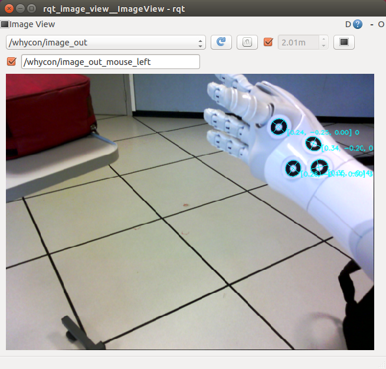

# pepper_hand_pose

[](https://youtu.be/P_XFdi1JciE)
[Video](https://youtu.be/P_XFdi1JciE)

## Prerequisites
* NAOqi C++ SDK
* ViSP
* Whycon

## Installation
* Clone the repo in your `catkin/src`   
 `$ cd ~/catking_ws/src`   
 `$ git clone https://github.com/lagadic/pepper_hand_pose.git`   
* Build the package:   
 `$ cd ~/catkin_ws`   
 `$ catkin_make -DNAOqi_DIR=/path/to/naoqi-sdk-2.5.5.5-linux64 -Dvisp_naoqi_DIR=/path/to/visp_naoqi/build-toolchain_pepper/sdk/cmake/ -Dvisp_DIR=/path_to_build_visp `   
 
## Customize your model
* Open the files in the `launch` folder   

```
hand_pose_camera_bottom.launch
hand_pose_camera_bottom_calibration_wrist_to_target.launch
hand_pose_camera_bottom_createTargetModel.launch
```
* and remember to change   

```xml
<param name="outer_diameter" value="0.01273"/>
<param name="inner_diameter" value="0.00522"/>
```

with the corresponding inner and outer diameter size of your whycon pattern.   

TODO: Save this values in a config file and load them in each launch file.

## Calibration Model 

## Create model target with Whycon:
* Launch the node  
 `$ roslaunch pepper_launch hand_pose_camera_bottom_createTargetModel.launch` 
* Visualize Whycon output image:
    `$ rqt_image_view`      
  and select the topic `/whycon/image_out`   

  

* Remove the stiffness from Choregraphe and place the hand of Pepper at the center of the image, where the target are well visible.
* Set the stiffness to 1 and stop the program hand_pose_camera_bottom_createTargetModel with `Ctrl+C`
* You should see in the terminal the following information:   

    ```
    cog 0.08539816923 -0.05145413801 0.2822599635 
    Torso M CameraBottom:
    -0.5349975824  -0.4311263859  0.726572454  0.03161015734
    -0.84485358  0.2730077803  -0.4600968957  -0.04408014193
    -7.450580597e-09  -0.859998107  -0.5102971196  0.2458400279
    0  0  0  1
    Torso M RWristYaw:
    0.9568784237  -0.283958137  0.06124651432  0.2019975185
    0.1155434251  0.1786029786  -0.9771132469  -0.2725745738
    0.2665204406  0.9420552254  0.2037108392  0.1178767681
    0  0  0  1 
    cMo -0.6095449217  0.00102354395  0.7927508861  0.08539816923
    -0.6101983569  -0.6389838624  -0.4683554431  -0.05145413801
    0.5060757201  -0.7692189045  0.3901137474  0.2822599635
    0  0  0  1
    Distance 0 - 1 0.03018964353 
    Distance 1 - 2 0.02087700683 
    Distance 2 - 3 0.02053476522 
    Distance 3 - 0 0.03496112965 
    C_points 0 0.06899768114 -0.07182741165 0.2864609063 
    C_points 1 0.09502162784 -0.05733739585 0.2815407217 
    C_points 2 0.09701936692 -0.03781982139 0.2744047046 
    C_points 3 0.08055400103 -0.03883192316 0.2866335213 
    O_points 0 0.02455456749 0.00976996183 -0.001820722322 
    O_points 1 -0.00263996687 0.004322411236 0.01010387506 
    O_points 2 -0.01937863543 -0.002657799858 -0.0002374361193 
    O_points 3 -0.002535965192 -0.01143457321 -0.008045716616 
    
    
    ```
* Copy paste the last 4 lines (O_points). These are the coordinates of the center of the target wrt the center of mass of all the 4 blobs.   
* Open the file [pepper_hand_pose.cpp](https://github.com/lagadic/pepper_hand_pose/blob/master/src/pepper_hand_pose.cpp#L47) and modify at line 47 the vector `m_3Dpoints` with your values.   
* Save the file and compile with `catkin_make`   

TODO: Save the coordinates in a file and load them.   


  
## Compute transformation between wrist joint frame and target  
* Launch the node and place the hand in the field of view of the camera    
    `$ roslaunch pepper_launch hand_pose_camera_bottom_calibration_wrist_to_target.launch`
* Click with the left button on the Visp viewer when you want to save the transformation matrix. A file `/tmp/eMh_pepper.xml` will be created, that looks like this:
 
     ```
      <?xml version="1.0"?>
    <root>
      <!--This file stores homogeneous matrix used
       in the vpHomogeneousMatrix Class of ViSP available
       at http://www.irisa.fr/lagadic/visp/visp.html .
       It can be read with the parse method of
       the vpXmlParserHomogeneousMatrix class.-->
      <!--Homogeneous Matrix-->
      <homogeneous_transformation>
        <!--Name of the homogeneous matrix-->
        <name>eMh_RArm</name>
        <values>
          <!--Translation vector with values in meters-->
          <tx>0.018365</tx>
          <ty>0.027611</ty>
          <tz>-0.007083</tz>
          <!--Rotational vector expressed in angle axis representation with values in radians-->
          <theta_ux>0.054571</theta_ux>
          <theta_uy>0.030174</theta_uy>
          <theta_uz>0.099821</theta_uz>
        </values>
      </homogeneous_transformation>
    
    </root>
     
     ```
* Replace the file [/pepper_launch/data/transformation/eMh_pepper.xml](https://github.com/lagadic/pepper_launch/blob/master/data/transformation/eMh_pepper.xml) with the new one just generated.


# Compute hand pose:   

`$ roslaunch pepper_launch hand_pose_camera_bottom.launch`


